# Домашнее задание: «Вычислительные мощности. Балансировщики нагрузки»

## Цель задания
Развернуть инфраструктуру в **Yandex Cloud** с помощью **Terraform**:
- создать бакет Object Storage и разместить в нём картинку;
- создать группу виртуальных машин в публичной подсети;
- опубликовать веб-страницу со ссылкой на картинку из бакета;
- подключить группу ВМ к сетевому балансировщику;
- проверить отказоустойчивость при удалении одной или нескольких ВМ.

> Дополнительная часть с AWS в этой работе не выполнялась.

---

## Используемые инструменты
- Terraform
- Yandex Cloud
- yc CLI
- SSH
- Object Storage
- Network Load Balancer

---

## Terraform-файлы проекта
- `providers.tf`
- `variables.tf`
- `network.tf`
- `storage.tf`
- `ig.tf`
- `nlb.tf`
- `outputs.tf`
- `personal.auto.tfvars`

---

# 1. Инициализация Terraform

```bash
terraform init
```

# 2. Проверка конфигурации

```bash
terraform validate
terraform plan
```

Скриншот:

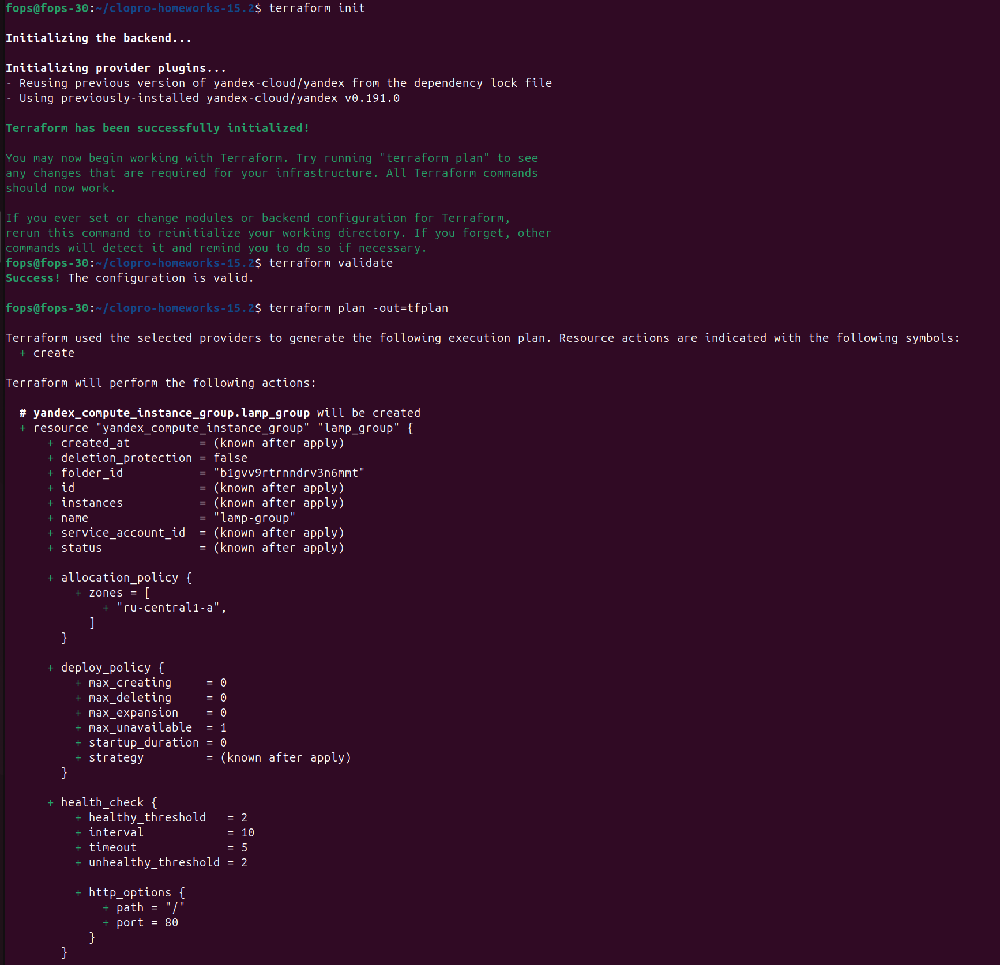
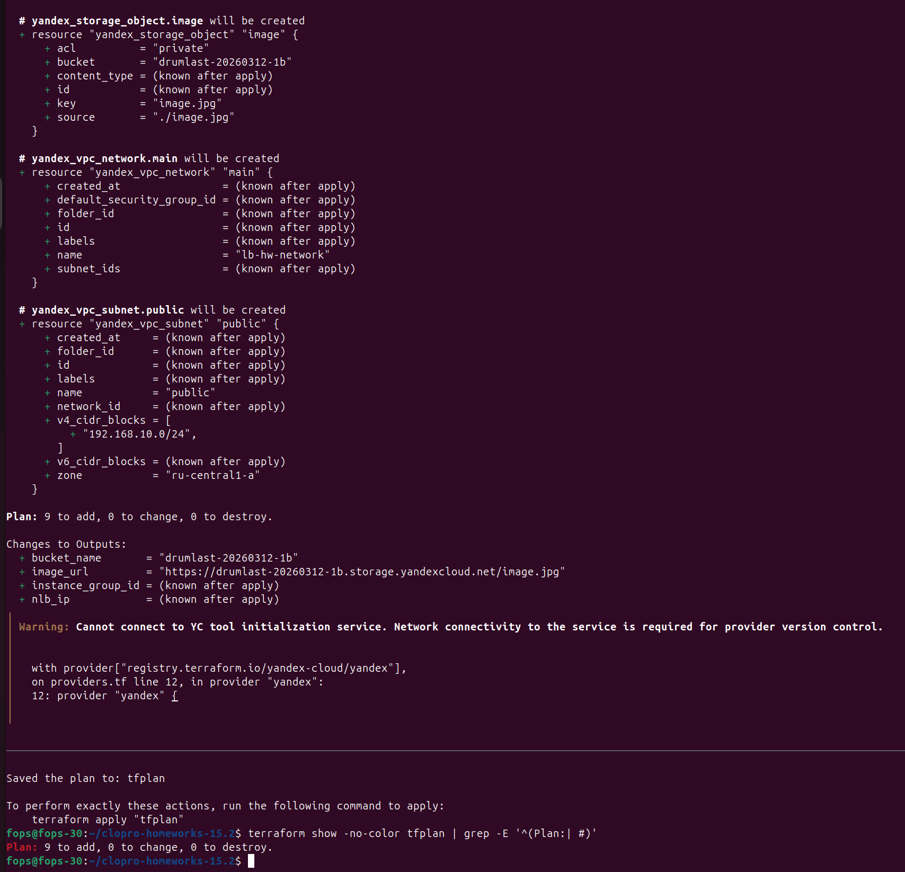

---

# 3. Применение конфигурации

```bash
terraform apply
```

Скриншот:

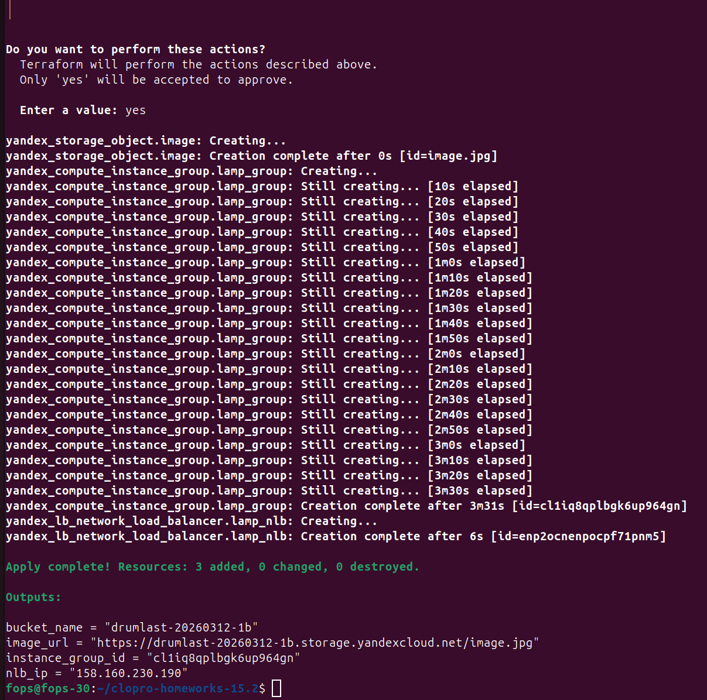
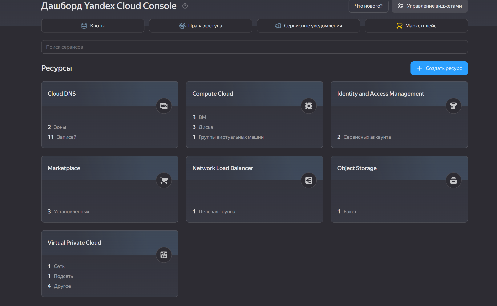

---

# 4. Проверка Object Storage

## Проверка бакета и объекта

```bash
yc storage bucket list
aws --endpoint-url=https://storage.yandexcloud.net s3 ls
aws --endpoint-url=https://storage.yandexcloud.net s3 ls s3://<bucket-name>
```

## Проверка публичной доступности картинки

```bash
curl http://<bucket-name>.storage.yandexcloud.net/<image-file>
```

Скриншот:

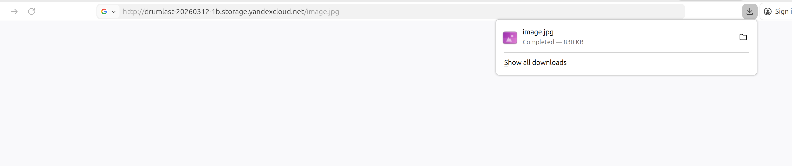
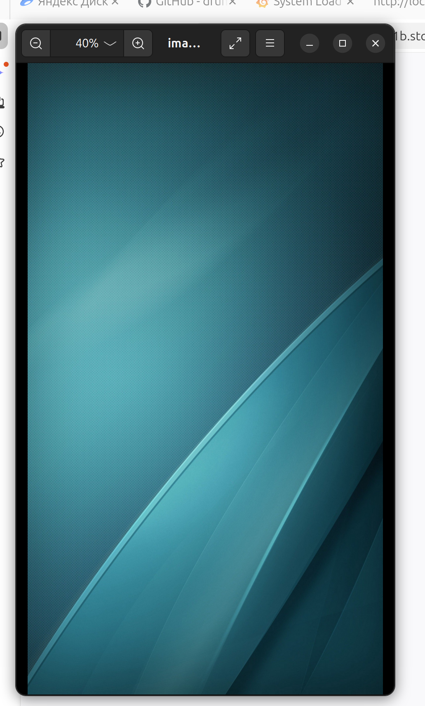
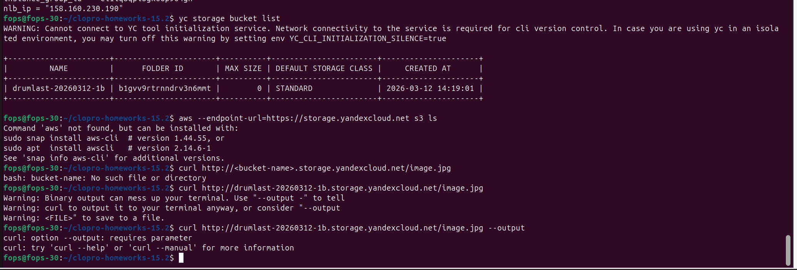

---

# 5. Проверка группы ВМ

## Список ВМ

```bash
yc compute instance-group list
yc compute instance-group list-instances <instance-group-name>
yc compute instance list
```

Скриншот:

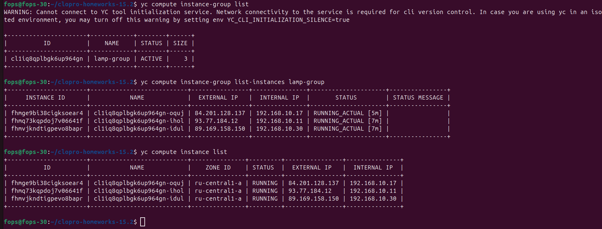

---

# 6. Проверка стартовой веб-страницы

На веб-странице должна отображаться ссылка или картинка из Object Storage.

## Проверка через IP балансировщика

```bash
curl http://<nlb_ip>
```

Либо открыть в браузере:

```text
http://<nlb_ip>
```

Скриншот:

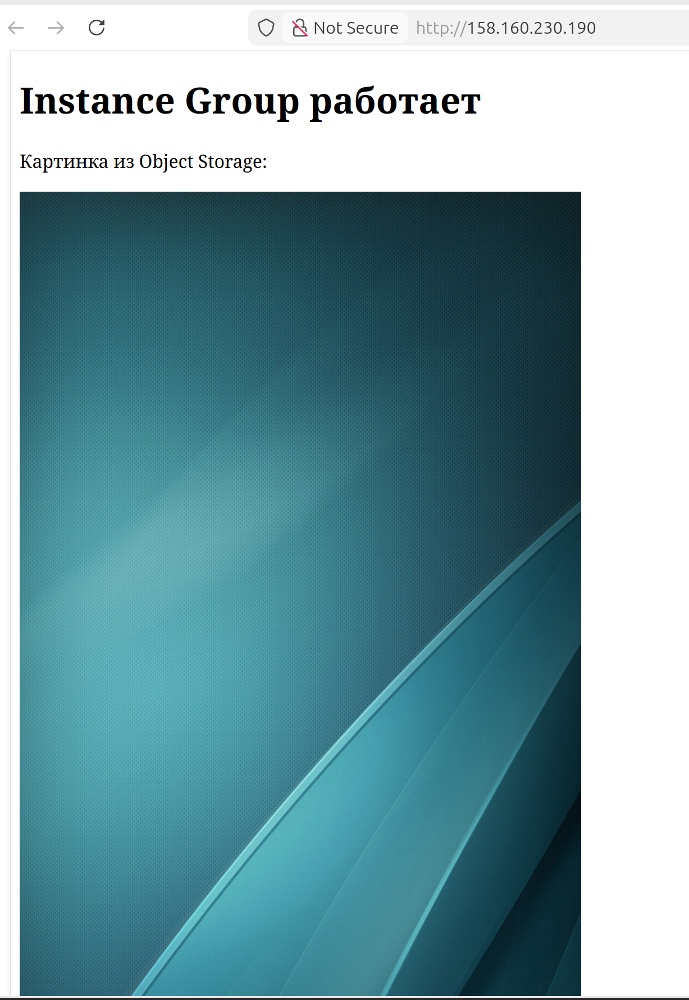

---

# 7. Проверка сетевого балансировщика

## Проверка ресурсов

```bash
yc load-balancer network-load-balancer list
yc load-balancer network-load-balancer get <nlb-name>
```

Скриншот:

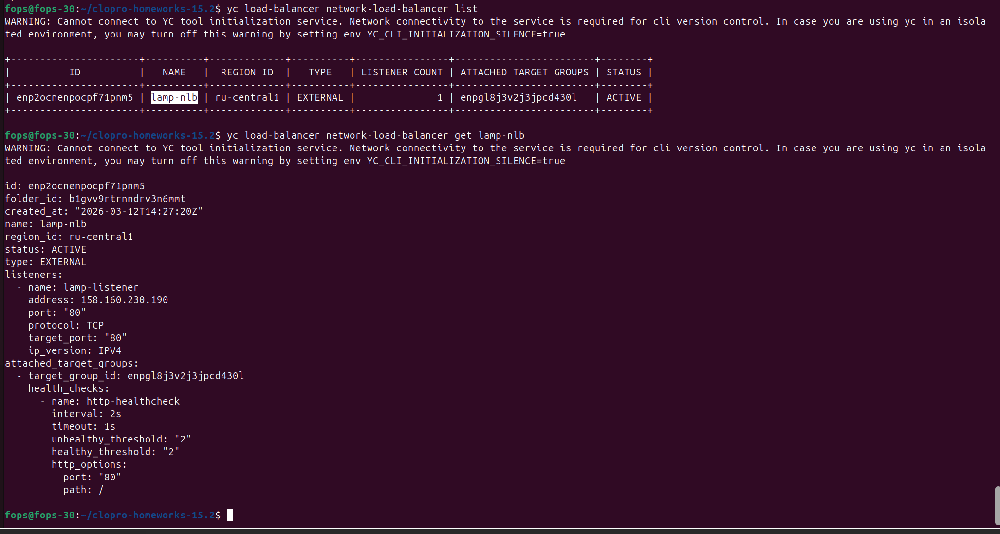

---

# 8. Проверка отказоустойчивости

Удаляем одну ВМ из instance group и проверяем, что сервис остаётся доступен.

## Получение списка ВМ группы

```bash
yc compute instance-group list-instances <instance-group-name>
```

## Удаление одной ВМ

```bash
yc compute instance delete <instance-id>
```

## Повторная проверка доступности

```bash
curl http://<nlb_ip>
```

Скриншот:

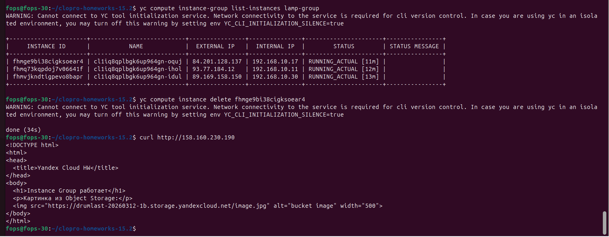

---

# 9. Проверка восстановления группы

После удаления ВМ instance group должна восстановить необходимое количество экземпляров.

```bash
yc compute instance-group list-instances <instance-group-name>
yc compute instance list
```

Скриншот:

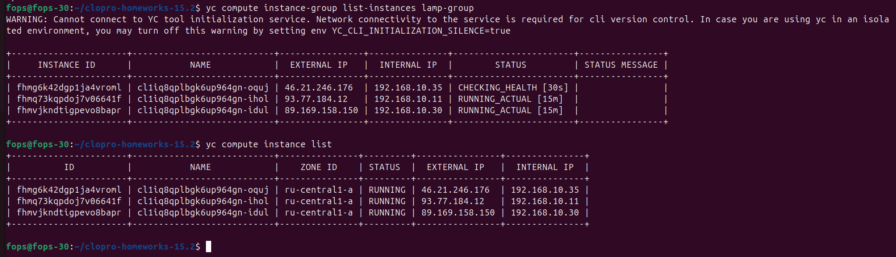

---

# Итог

В результате с помощью Terraform были созданы:
- VPC и публичная подсеть;
- бакет Object Storage и публично доступный файл с картинкой;
- Instance Group из трёх ВМ с шаблоном LAMP;
- стартовая веб-страница, содержащая ссылку на изображение из Object Storage;
- сетевой балансировщик нагрузки;
- механизм проверки доступности и автоматического восстановления экземпляров.

Проверка показала, что при удалении одной из виртуальных машин сервис продолжает работать через балансировщик, а группа ВМ автоматически восстанавливает требуемое количество экземпляров.

